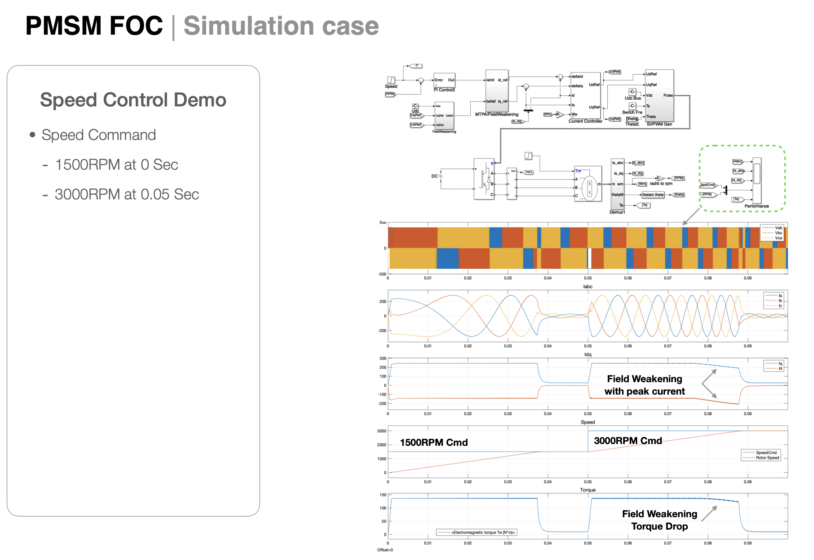

# motorControl
**motor control simulation with Simulink for ECE517 Finle** 
* Some fundamental introduction for how motor, inverter, control works
* [final project Report](https://github.com/foreverui/motorControl/blob/main/PMSM%20FOC%20Control%20PDF.pdf) 
* [Simulink Model](https://github.com/foreverui/motorControl/blob/main/PMmotorFocECE517.slx) 

**If you like it and would like to encourage me more, Please and Appreciate**  
* Click Here [American Heart Association](https://raiseyourwayforaha.funraise.org/fundraiser/ethan-guan?fundraiserPrompt=2854525) and Donate **$1** 
* Tell your friends

**Future work proposal**
* from S to Z
* lookup table for Ld/Lq, 
* dvpwm, 
* torque ripple conpensation

